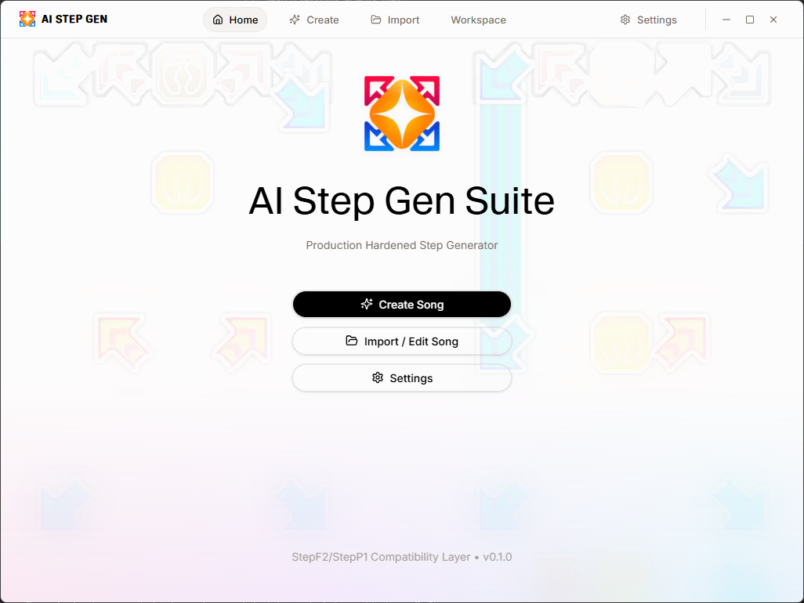

<p align="center">
  
</p>

<h1 align="center">AI Step Gen Suite</h1>
<h2 align="center">Version 0.1.0-alpha.7</h2>
<p align="center">
  <strong>A production-hardened, secure desktop application designed to generate creative StepF2 / StepP1 charts using Gemini AI, with focus on security, file integrity, and exact SSC preservation.</strong>
</p>

<p align="center">
  
  
  
  
</p>

---

## 📸 Application Showcase

Here is a preview of the **AI Step Gen Suite** interface in action, showcasing the song selection, preview, and chart generation workflow:

<p align="center">
  
</p>

---

## 🚀 Key Features

- 📂 **Local Song Pack Import**
  - Recursively scans local folders to import song packages.
  - Parses native `.ssc` structures to extract critical variables (BPM, Offsets, Song Info).
  - Resolves optional assets dynamically, such as audio files, banners, backgrounds, and preview videos.
- 🔒 **Bring Your Own Key (BYOK) Security**
  - **Zero Local Plaintext:** Plaintext API keys are never stored in the frontend or local storage.
  - **Strong Encryption:** Keys are encrypted in Rust using **AES-256-GCM**.
  - **Passphrase-Based Key Derivation:** Uses **PBKDF2-SHA512** with 600,000 iterations to derive the encryption key from a user passphrase.
  - **Memory Safety:** Attempts to zeroize critical intermediate key buffers in Rust memory using the `zeroize` crate to minimize key lifetime in memory.
- ⚡ **Atomic Chart Generation & Integrity**
  - Generates and appends valid custom test charts (`pump-single` or `pump-double`) dynamically to the `.ssc` file using Gemini AI.
  - **Strict Preservation:** Preserves existing charts, notes content, and structural metadata without regression.
  - **Atomic Write Pattern:** Writes output first to a temporary file on the same volume, flushes data to physical media, and atomically renames/replaces the original file.
- 🛡️ **Hardened Tauri Desktop Sandbox**
  - Removed standard Tauri template greet commands to reduce attack surface.
  - Strict Content Security Policy (CSP) limits outbound requests solely to local loopback and the Gemini API endpoints (`https://generativelanguage.googleapis.com`).

---

## 🛠️ Tech Stack

| Layer                | Technologies                                                             |
| :------------------- | :----------------------------------------------------------------------- |
| **Frontend**         | React 19.2, TypeScript, Tailwind CSS, Zustand (with Immer state updates) |
| **Desktop Core**     | Rust, Tauri v2, Cargo                                                    |
| **Cryptography**     | `aes-gcm`, `pbkdf2`, `sha2`, `zeroize`                                   |
| **Audio Processing** | Python Sidecar _(Planned: DSP / Librosa / Madmom for beat analysis)_     |

---

## 📦 Setup & Running

### Requirements

Ensure you have the following installed on your machine:

- [Node.js](https://nodejs.org/) (with `pnpm` installed globally: `npm i -g pnpm`)
- [Rust toolchain](https://www.rust-lang.org/) (`cargo`, `rustc`)

### Development Setup

1.  **Install dependencies:**
    ```bash
    pnpm install
    ```
2.  **Run in development mode:**
    ```bash
    pnpm tauri dev
    ```

### Production Build

Build the production-ready desktop bundle:

```bash
pnpm build
```

---

## 🧪 Testing

The repository contains a robust Rust test suite covering key derivation, AES-256-GCM encryption/decryption, incorrect passphrase recovery, and atomic chart stub appending.

To run the tests:

```bash
cd src-tauri
cargo test
```

---

## ⚖️ License & Disclaimers

This project is licensed under a custom **Personal and Non-Commercial Source License**. See the [LICENSE](LICENSE) file for the full legal text.

### Important Declarations:

- **Non-Commercial & Personal Use Only:** This software and its source code are strictly for personal, recreational, and non-commercial educational use. Commercial distribution or hosting is prohibited.
- **No Copyright Songs Included:** No audio, music, or copyrighted song assets are distributed with this software. Users must provide their own audio files and charts, and do so at their own risk. The Author(s) disclaim any liability for copyright infringement related to external audio used by the software.
- **Not Affiliated with Andamiro:** This project is an independent community development tool and is in no way affiliated with, authorized, sponsored, or endorsed by Andamiro Co., Ltd., the "Pump It Up" brand, or any of their affiliates.
- **Not Affiliated with Google/Gemini:** Gemini is a third-party technology used by this software via Google APIs. This software is not sponsored, endorsed, or affiliated with Google LLC, Alphabet Inc., or the "Gemini" brand.
- **Fonts Notice:**
  - _Waldenburg_: Any Waldenburg fonts included in the repository are trial versions and restricted strictly to personal, non-commercial use.
  - _Inter & Geist Mono_: Available for free from Google Fonts under the SIL Open Font License, Version 1.1.
